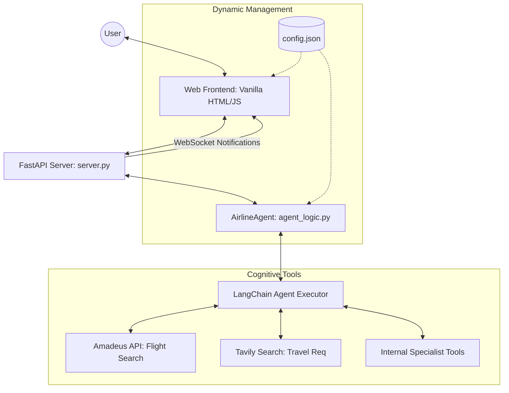

# 🏗️ Sunfar Elite - Technical Infrastructure

This document provides a detailed technical breakdown of the **Sunfar Elite AI Concierge** architecture, data flows, and infrastructure components.

---

## 🛰️ System Architecture Overview

The system is built on a **Decoupled Agentic Framework**, separating the presentation layer from the cognitive reasoning engine.



---

## 🧠 Backend Architecture (Python & LangChain)

### 1. The Core Agent (`agent_logic.py`)
- **Framework**: Built using `langchain` with OpenAI's `gpt-4-turbo-preview`.
- **Orchestration**: Uses a `create_openai_functions_agent` to intelligently select tools based on user intent.
- **Dynamic Prompting**: The System Prompt is reconstructed on **every request**. It pulls real-time data from `config.json`, ensuring that any changes to company info are immediate.

### 2. Specialized Agent Tools
We use a "Specialist Cluster" pattern where the main Orchestrator delegates high-stakes tasks to specialized tools:
- **`flight_search_tool`**: Interfaces with the **Amadeus API** for real-time seat availability and pricing.
- **`travel_req_agent_tool`**: Uses **Tavily Search** to crawl official government and embassy sites for up-to-date visa/passport requirements.
- **`payment_agent_tool`**: A specialized sandbox for handling refund and payment inquiries with premium guardrails.

### 3. API Entry Point (`server.py`)
- **FastAPI**: Provides high-performance async endpoints.
- **`/chat`**: Secure POST endpoint for the main interaction.
- **`/notifications`**: A **WebSocket** server that broadcasts real-time trip alerts (e.g., Gate Changes) directly to the UI.

---

## 🎨 Frontend Architecture (Modern Minimalist)

### 1. Presentation Layer
- **Tech**: Vanilla HTML5, CSS3 (with CSS Variables for easy theming), and Modern JavaScript.
- **Responsive Engine**: Uses media queries and a mobile-specific header to transform from a Desktop Sidebar layout to a Mobile Chat interface.

### 2. Data Synthesis (`app.js`)
- **Dynamic Loading**: On `window.onload`, the client fetches `config.json` via the `/config.json` endpoint to populate all sidebar contact details without hardcoding.
- **WebSocket Listener**: Maintains a persistent connection to the backend to display non-intrusive "Elite Notifications" at the bottom of the screen.

---

## ⚙️ Dynamic Configuration (`config.json`)

The "Single Source of Truth" for all corporate variables. Decoupling this data allows the business to update hotline numbers, addresses, and hours without touching the application code.

```json
{
  "company": { "name": "Sunfar Travel", "hotline": "01-8243993" },
  "technical": { "founder": "MR. KYAW ZIN TUN" }
}
```

---

## 🛡️ API Resilience & Error Handling (Amadeus Specific)

To ensure the AI remains "Elite" even during technical failures, we have documented the following critical error codes for the Amadeus Flight API:

| Code | Status | Technical Meaning | Solution / Action |
|:---:|:---|:---|:---|
| **400** | **Bad Request** | Invalid query parameters (e.g., incorrect airport codes or past dates). | AI will ask the user for clarification or date correction. |
| **401** | **Unauthorized** | The API Key or Secret in `.env` is invalid or has expired. | TECHNICAL LEAD (Mr. Kyaw Zin Tun) must refresh credentials. |
| **402** | **Quota Exceeded** | The free/test tier monthly allowance has been reached. | The AI should guide users to the Offline Hotline (01-8243993) for manual booking. |
| **429** | **Rate Limit** | Too many requests in a short period. | AI will ask the user to wait a few seconds or call the Hotline. |
| **500+** | **Server Error** | Amadeus downstream service issues. | AI will suggest retrying or using the Hotline for manual check. |

### Error Recovery Flow:
1. **Detection**: The `flight_search_tool` catches these codes from the Amadeus SDK.
2. **Cognitive Fallback**: Instead of crashing, the Agent uses the "Hotline Strategy" documented in `agent_logic.py`.
3. **Graceful Redirection**: The user is informed of "Technical Maintenance" and provided with the direct company contact for immediate assistance.

---

## ⚡ Concurrency & Simultaneous User Management

To handle high traffic volume without exposing users to technical "Rate Limit" errors, the system employs an **Asynchronous Priority Queue & Semaphore System**.

### 1. Backend Concurrency (FastAPI)
- **Async Execution**: The FastAPI server processes user requests in parallel using non-blocking I/O.
- **Semaphore Guard**: We use an `asyncio.Semaphore(limit=3)` inside the `flight_search_tool`. This ensures that even if 100 users search at once, the system only sends 3 simultaneous requests to Amadeus at any microsecond, preventing an immediate **429 (Too Many Requests)** error.

### 2. User Experience (The "Elite" Buffer)
- **Queuing Strategy**: If the API limit is nearing exhaustion or the semaphore is full, the AI provides a "Delighted Buffer" response.
- **Direct Redirection**: Instead of showing a technical timeout, the AI intelligently suggests: *"We are currently experiencing high booking volume. To secure your seat instantly, please dial our direct Hotline at 01-8243993."*

### 3. Scaling for Production
- **Horizontal Scaling**: The Stateless nature of the Python backend allows it to be deployed behind a Load Balancer (e.g., NGINX or AWS ALB).
- **Session Persistence**: Chat history is passed in each request, allowing the Agent to maintain context across different server instances.

---

## ☁️ Cloud Deployment & Production Hosting

To ensure zero-latency and high reliability, the system is deployed on **Modal Cloud**.

- **Production URL**: [https://kyawzin-ccna--sunfar-elite-airline-run.modal.run](https://kyawzin-ccna--sunfar-elite-airline-run.modal.run)
- **Deployment Strategy**: 
  - The backend runs as a serverless ASGI application.
  - Dependencies are packaged into a optimized Debian Slim container.
  - Secrets are managed via `modal.Secret` (syncing with `.env`).
  - Auto-scaling is enabled to handle simultaneous users without local connectivity bottlenecks.

---

## 🛡️ Interaction & Guardrail Flow

1. **User Input**: Captured via UI.
2. **Analysis**: `agent_logic.py` performs a sentiment and language analysis first.
3. **Cognitive Routing**: The Agent decides if the query is **Travel-related (In-Scope)** or **Off-topic (Out-of-Scope)**.
4. **Context Retrieval**: If in-scope, the Agent reloads `config.json` to ensure current company details are used in its internal reasoning.
5. **Tool Execution**: If a flight search or visa check is needed, the respective API tool is triggered.
6. **Response Generation**: The final localized, professional response is sent back to the `/chat` endpoint.

---
**Technical Lead**: MR. KYAW ZIN TUN  
**Powered by**: itsolutions.mm
